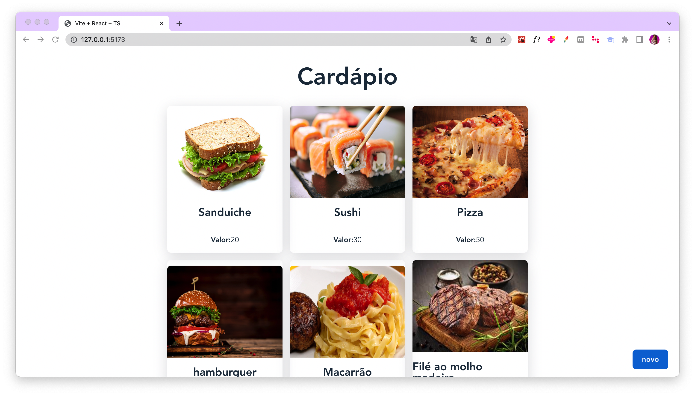

# Cardápio Digital - Aplicação Frontend

Este projeto é um simples protótipo de um Cardápio Digital desenvolvido com base num projeto da Fernanda Kipper em seu [tutorial no YouTube](https://www.youtube.com/@kipperdev). A aplicação foi desenvolvida usando **React, Typescript e React Query**.

<h1 align="center">
    
    
</h1>